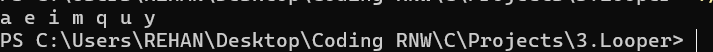
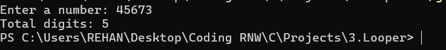
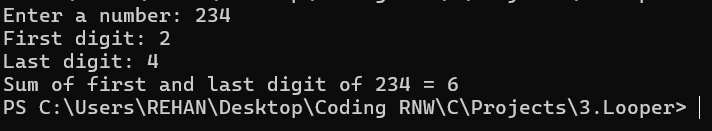

# 📘 C Programming Practice – Basic Programs

This repository contains three beginner-friendly C programs for practice. Each program demonstrates core programming concepts such as loops, conditionals, and basic math operations.

---

## 📌 1. Print Alphabets from 'a' to 'z' by Skipping 3 Letters

### ✅ Description:
Prints all lowercase English alphabets starting from `'a'` and skipping every 3 letters using a `do-while` loop.

### 💻 Code Logic:
- Start from `'a'`
- Add 4 to skip 3 characters (`a → e → i → m → q → u → y`)
- Use a `do-while` loop

### 📦 Sample Output:
- 

---

## 📌 2. Count Total Digits in a Number

### ✅ Description:
Reads an integer input from the user and counts how many digits it contains.

### 💻 Code Logic:
- Use `while (num != 0)` to divide the number by 10 repeatedly.
- Special case for input `0`, which has 1 digit.

### 📦 Sample Output:
- 

---

## 📌 3. Sum of First and Last Digit of a Number

### ✅ Description:
Calculates and prints the sum of the first and last digits of an integer.

### 💻 Code Logic:
- Extract last digit using `num % 10`
- Loop through digits using `num = num / 10` to find the first digit
- Add first and last digits

### 📦 Sample Output:
- 
