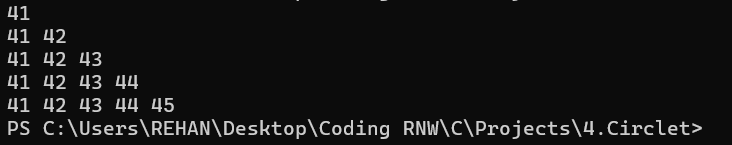
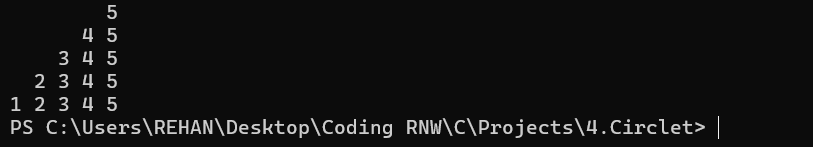
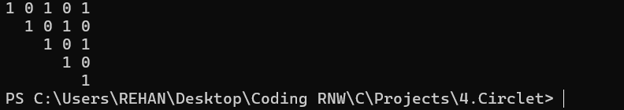
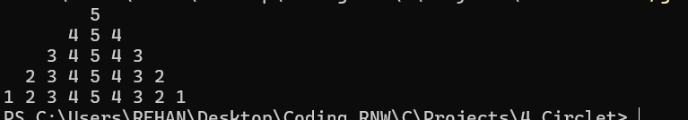
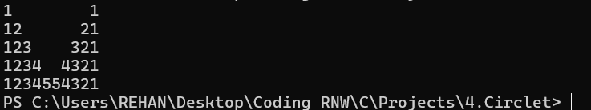
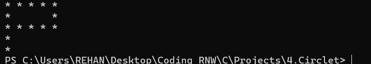

Here’s a complete, **well-formatted README.md** file you can use for your C Pattern Printing Project. It includes:

* 📌 Project description
* 💡 Individual program descriptions
* ✅ Sample output image sections
* 🛠️ How to run
* 🔚 Conclusion

You can use this in GitHub or any portfolio project.

---

# 🔢 Pattern Printing Programs in C

This project demonstrates the use of **nested `for` loops** in the C programming language by printing various number and character patterns. It is a great exercise for understanding control structures and logic building in C.

---

## 📂 Project Structure

Each program is written using **nested `for` loops**, with an emphasis on formatting and logical structure. Below is a summary of each program and the pattern it prints.

---

### 📘 Q1. Right Half Triangle Pattern

**Pattern:**
```

41
41 42
41 42 43
41 42 43 44
41 42 43 44 45

```

🖼️ **Sample Output Image:**


---

### 📘 Q2. Floyd's Triangle Starting at 11

**Pattern:**
```

11
12 13
14 15 16
17 18 19 20

```

🖼️ **Sample Output Image:**


---

### 📘 Q3. Left Half Triangle Pattern

**Pattern:**
```

```
        5  
      4 5  
    3 4 5  
  2 3 4 5
1 2 3 4 5

```

🖼️ **Sample Output Image:**


---

### 📘 Q4. Inverted Left Half Binary Pattern

**Pattern:**
```

1 0 1 0 1
1 0 1 0
1 0 1
1 0
1

```

🖼️ **Sample Output Image:**


---

### 📘 Q5. Full Pyramid Pattern

**Pattern:**
```
        5  
       454  
      34543  
     2345432
    123454321

```

🖼️ **Sample Output Image:**


---

### 📘 Q6. Custom Numeric Pattern

**Pattern:**
```

1         1
12       21
123     321
1234   4321
12345 54321

```

🖼️ **Sample Output Image:**


---

### 📘 Q7. Custom Alphabetic Pattern




