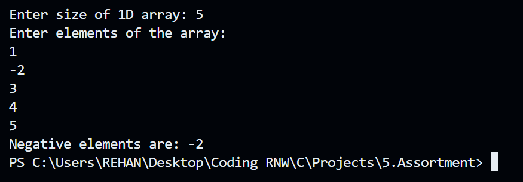

# 🔢 C Project: Array Operations Using Loops

This project contains **four C programs** that demonstrate how to work with **1D and 2D arrays** using **loops** and **conditional logic**. It covers tasks like finding negative numbers, computing transpose, row/column sums, and identifying the largest element in a matrix.

---

## 📦 Programs Included

1. **Negative Elements in 1D Array**
Description:

User enters size and elements of a 1D array.
Program prints all negative numbers.
If no negatives, it prints: Negative elements are: 0.

### Sample Output:



2. **Largest Element in 2D Array**
Description:

User enters matrix size and elements.
Program finds and displays the largest element.

### Sample Output:


3. **Transpose of a 2D Matrix**
Description:

User inputs a matrix.
Program prints the transpose, i.e. rows become columns.

### Sample Output:


4. **Sum of Elements in Row & Column (2D Array)**
Description:

User enters a matrix.
Inputs a row number → Program prints that row and its sum.
Inputs a column number → Program prints that column and its sum.

### Sample Output:


---

## 🧠 Concepts Covered

- 1D and 2D arrays
- Nested `for` loops
- Conditional statements (`if`, counters)
- Matrix operations
- User input/output handling

---

## ⚙️ How to Compile and Run (Using GCC)

```bash
gcc filename.c -o output
./output
