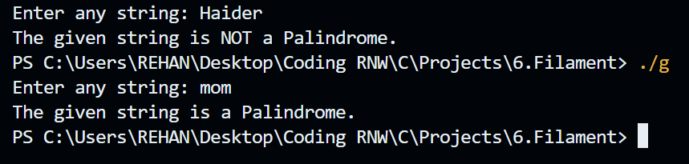
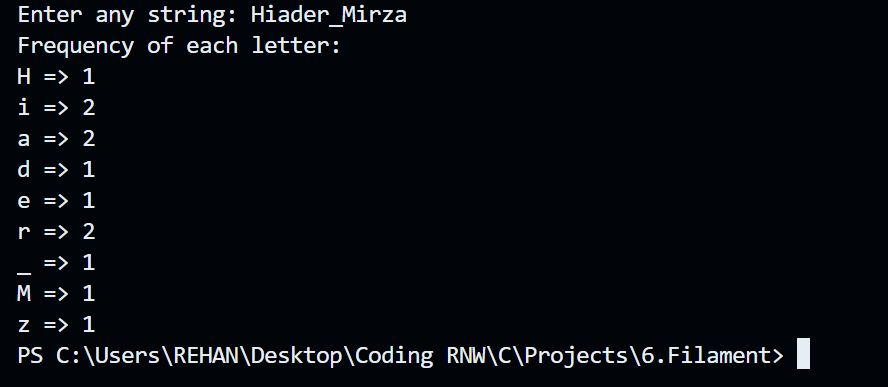

# 🧠 String Utilities in C (No String Library Functions)

This project contains two simple but powerful C programs to demonstrate string manipulation **without using any string library functions** like `strlen()`, `strrev()`, etc.

---

## ✅ Programs Included

### 1. 🚦 Palindrome Checker (`palindrome_checker.c`)
- Takes a string input from the user.
- Manually calculates the length of the string.
- Compares characters from the start and end to check if the string is a **Palindrome**.

## Sample Output:


### 2. 📊 Frequency Counter (`frequency_counter.c`)
- Takes a string input from the user.
- Manually counts how often each character appears.
- Ignores already counted characters using a `visited[]` array.

## Sample Output:

---

## 🚫 No String Library Functions Used

These programs **do not use** any of the common string handling functions like:
- `strlen()`
- `strcpy()`
- `strrev()`
- `strcmp()`
- `strcat()`

Instead, **manual iteration and logic** is used to ensure clear understanding of string handling in C.

---

## 🔧 How to Compile and Run

### 📌 Compile

```bash
gcc palindrome_checker.c -o palindrome_checker
./palindrome_checker

