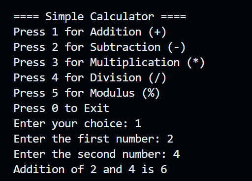

## 🧮 Simple C Calculator Program

### 📌 Overview

This project is a **menu-driven calculator program** written in **C language** that demonstrates:

* User Defined Functions (UDF)
* `switch-case` control structure
* Looping (`while`)
* Arithmetic operations: Addition, Subtraction, Multiplication, Division, and Modulus

The program keeps running until the user chooses to exit.

---

### 🛠️ Features

* Modular code with clean UDFs for each operation
* Handles division and modulus by zero
* Runs in an infinite loop until the user exits
* Interactive menu for user input

---

### 🧾 Code Description

The `main()` function contains:

* A menu printed inside an infinite loop
* `scanf()` to take the user's choice and numbers
* `switch-case` to call respective UDFs:

  * `add(int a, int b)`
  * `subtract(int a, int b)`
  * `multiply(int a, int b)`
  * `divide(int a, int b)`
  * `modulus(int a, int b)`
* A check for division or modulus by zero
* `break` statement to exit when the user presses 0

---


### 🖼️ Output Screenshot

```


```
---

### 📚 Concepts Used

* `while(1)` loop
* `switch-case` control structure
* Modular programming with UDF
* `printf()` and `scanf()`
* Error handling for division/modulus by 0

---

### ✅ Author

**Name:** Your Name
**Language:** C Programming
