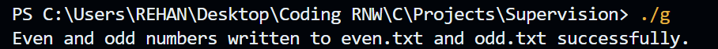
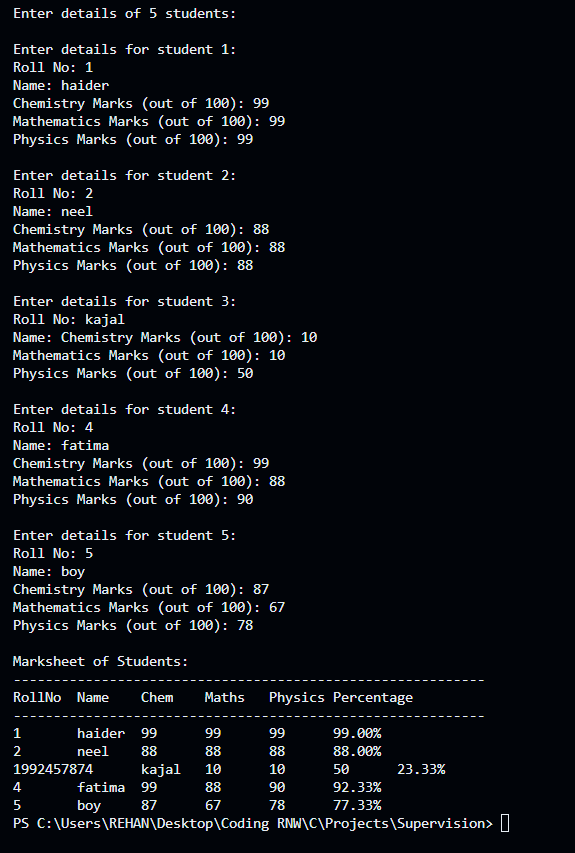

# 📘 C Programming Project – File Handling & Structures

## 📌 Project Overview

This project demonstrates the use of **File Handling** and **Structures** in the C programming language.
It consists of **two programs**:

1. **File Handling Program** – Writes even and odd numbers from `50 to 70` into two separate files.
2. **Structures & Percentage Calculation Program** – Generates mark sheets for 5 students and calculates their percentage.

---

## ⚡ Features

### 🔹 Q.1 File Handling

* Creates two files:

  * `even.txt` → stores even numbers between 50 and 70
  * `odd.txt` → stores odd numbers between 50 and 70
* Demonstrates `fopen`, `fprintf`, and `fclose` functions.

### 🔹 Q.2 Structures & Percentage Calculation

* Uses a `struct Student` to store details:

  * Roll Number
  * Name
  * Marks in Chemistry, Mathematics, Physics
* Accepts input for **5 students**.
* Calculates **percentage** = (Chemistry + Maths + Physics) / 3.
* Displays a **tabular marksheet** with percentages.

---

## 🛠️ How to Run

1. **Clone / Copy the Code** into your system.
2. Compile using any C compiler (e.g., GCC).

### 🔹 For Q.1 (File Handling)

```bash
gcc file_handling.c -o file_handling
./file_handling
```

* Output files: `even.txt` and `odd.txt`

* Sample Output : 


### 🔹 For Q.2 (Structures & Percentage)

```bash
gcc marksheet.c -o marksheet
./marksheet
```

* Enter details for 5 students.
* Program displays a formatted **marksheet** with percentages.

---

### 🔹 Q.2 Structures & Percentage

```
Marksheet of Students:
-----------------------------------------------------------
RollNo  Name    Chem    Maths   Physics Percentage
-----------------------------------------------------------
1       Ali     80      90      85      85.00%
2       Sara    75      60      70      68.33%
...
```

---

## 📖 Concepts Covered

* File Handling in C

  * `fopen()`, `fprintf()`, `fclose()`
* Loops and Conditional Statements
* Structures (`struct`)
* Arrays of Structures
* Percentage Calculation

* Sample Output : 